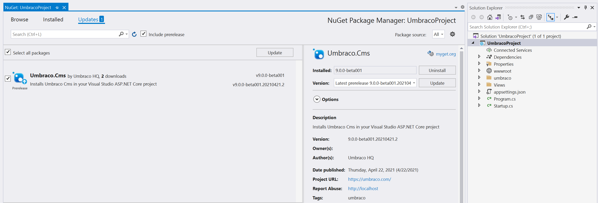

# Upgrades in general

_This is the guide for upgrading in general._

:::warning
**Important**: If you are upgrading to a new major version, like from Umbraco 8 to Umbraco 9, make sure to check out the **[version-specific documentation.](version-specific.md)**

Things may go wrong for various reasons. Make sure to **ALWAYS** make a backup of both your site's files and the database so that you can return to a version that you know works. You will need the backed up files for merging later so this step is not optional.

Before upgrading to a new major version, check if the packages you're using are compatible with the version you're upgrading to. On the package's download page, in the **Project compatibility** area, click **View details** to check version-specific compatibility.
:::

Sometimes there are exceptions to these guidelines, which are listed in the **[version-specific guide](version-specific.md)**.

## Note

It is necessary to run the upgrade installer on each environment of your Umbraco site. So if you want to update your staging and your live site then you need to repeat the steps below and make sure that you click through the install screens so that your upgrade is complete.

## Contents

In this article you will find instruction of 3 different ways of upgrading:

* [Upgrade using NuGet](#upgrade-using-nuget)
* [Upgrade manually from a Zip file](#upgrade-manually-from-a-zip-file)
* [Run an unattended upgrade](#run-an-unattended-upgrade)

## Upgrade using NuGet

You can open up the **Package Console** and type:
`Update-Package Umbraco.Cms`

You will be prompted to overwrite files, you should choose **"No to All"** by pressing the **"L"** . If there are any specific configuration changes required for the version you are upgrading to then they will be noted in the **[version-specific guide](version-specific.md)**.

Or you can open the **NuGet Package Manager** for your project and select the **Updates** pane to get a list of available updates. Choose the package called **Umbraco.Cms** and click Update. This will run through all the files and make sure you have the latest changes while leaving files you have updated.

